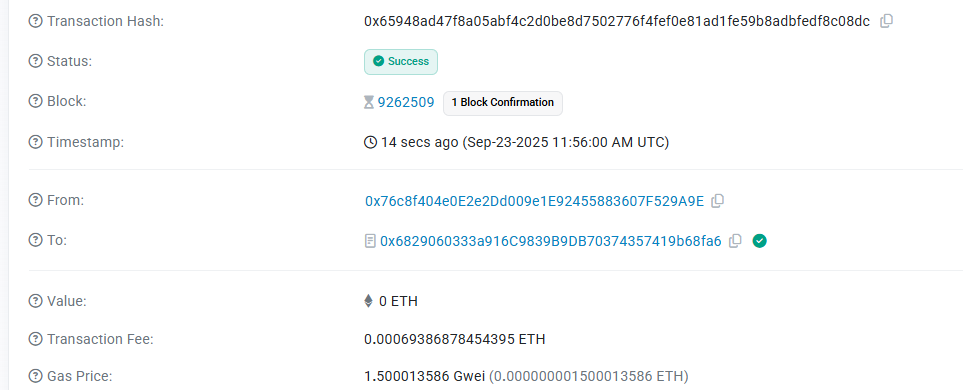

# Privacy Customer Feedback System

A revolutionary privacy-preserving customer feedback platform built with **Fully Homomorphic Encryption (FHE)** technology, enabling confidential feedback analysis without compromising user privacy.

## 🔐 Core Concepts

### FHE Contract Privacy Customer Feedback - Confidential Feedback Analysis

This system leverages **Zama's FHE technology** to create a privacy-first feedback collection and analysis platform. The core innovation lies in performing computations on encrypted data without ever decrypting it, ensuring complete privacy protection while still enabling valuable business insights.

**Key Privacy Features:**
- **End-to-End Encryption**: All feedback data is encrypted using FHE before being stored on the blockchain
- **Confidential Analysis**: Analytics are performed on encrypted data, never requiring decryption
- **Zero Knowledge Insights**: Business intelligence without revealing individual feedback details
- **Privacy-Preserving Aggregation**: Statistical analysis maintains complete anonymity

## 🏗️ System Architecture

The platform consists of three main components:

1. **Smart Contract Layer** (`PrivacyFeedback.sol`)
   - FHE-encrypted data storage
   - Confidential computation engine
   - Privacy-preserving analysis functions

2. **Web Interface** (`index.html`)
   - User-friendly feedback submission
   - Real-time system status
   - Wallet integration for Sepolia testnet

3. **Blockchain Integration**
   - Sepolia testnet deployment
   - MetaMask wallet connectivity
   - Gas-optimized transactions

## ⭐ Key Features

### 🔒 Privacy Protection
- **FHE Encryption**: All sensitive data encrypted using Zama FHE
- **Anonymous Analysis**: Perform analytics without exposing individual responses
- **Zero-Trust Architecture**: No party can access raw feedback data

### 📊 Confidential Analytics
- **Encrypted Aggregation**: Calculate statistics on encrypted data
- **Privacy-Preserving Insights**: Business intelligence without privacy compromise
- **Secure Reporting**: Analysis results maintain confidentiality

### 🛡️ Security Features
- **Blockchain Immutability**: Tamper-proof feedback storage
- **Access Control**: Owner-only analysis functions
- **Privacy Violation Detection**: Automated privacy protection monitoring

## 💼 Use Cases

- **Enterprise Feedback Systems**: Large corporations collecting sensitive customer opinions
- **Healthcare Patient Satisfaction**: Medical facilities gathering confidential patient feedback
- **Government Public Opinion**: Civic organizations conducting private citizen surveys
- **Financial Services Reviews**: Banks and financial institutions collecting confidential service feedback
- **Educational Institution Surveys**: Schools and universities gathering anonymous student feedback

## 🔗 Contract Address

**Sepolia Testnet**: `0x6829060333a916C9839B9DB70374357419b68fa6`

[View on Sepolia Etherscan](https://sepolia.etherscan.io/address/0x6829060333a916C9839B9DB70374357419b68fa6)

## 🎥 Demo Video

Watch our comprehensive demo showing the privacy feedback system in action:
- Wallet connection and setup
- Encrypted feedback submission
- Real-time analytics without privacy compromise
- Contract interaction demonstration

*Video file: `PrivacyFeedback.mp4`*

## 📸 Blockchain Transactions

The screenshot above demonstrates successful blockchain interactions with the privacy feedback contract, showing:
- Successful transaction confirmations on Sepolia testnet
- Gas usage optimization for FHE operations
- Real-time feedback submission processing

## 🚀 Live Application

Experience the privacy feedback system: **https://privacy-feedback.vercel.app/**

## 📋 Feedback Categories

The system supports 10 different feedback categories:
1. Product Quality
2. Customer Service
3. Delivery Speed
4. Pricing
5. User Experience
6. Technical Support
7. Website Features
8. Return Policy
9. Product Variety
10. Others

## 🔧 Technical Implementation

### FHE Operations
- **Encrypted Storage**: All feedback ratings, categories, and sentiment scores
- **Homomorphic Computations**: Average calculations, category analysis, sentiment aggregation
- **Privacy-Preserving Functions**: Statistical analysis without data exposure

### Smart Contract Functions
- `submitFeedback()`: Submit encrypted feedback data
- `performConfidentialAnalysis()`: Analyze encrypted data
- `getPublicStats()`: Retrieve non-sensitive statistics
- `getUserFeedbackCount()`: Privacy-preserving user feedback count

### Security Measures
- Input validation for all feedback parameters
- Access control for sensitive operations
- Gas optimization for FHE computations
- Emergency privacy protection functions

## 🌐 Network Information

- **Network**: Sepolia Ethereum Testnet
- **Chain ID**: 11155111
- **Required Wallet**: MetaMask or compatible Web3 wallet
- **Test ETH**: Available from [Sepolia Faucet](https://sepoliafaucet.com/)

## 💡 Innovation Highlights

1. **First-of-its-kind**: Privacy-preserving feedback system using production-ready FHE
2. **Business Ready**: Real-world applicable with enterprise-grade privacy protection
3. **Blockchain Native**: Fully decentralized with immutable privacy guarantees
4. **User-Friendly**: Intuitive interface hiding complex cryptographic operations
5. **Scalable Architecture**: Designed for high-volume feedback processing

## 🔮 Future Enhancements

- Multi-chain deployment support
- Advanced analytics dashboard
- API integration for enterprise systems
- Mobile application development
- AI-powered sentiment analysis on encrypted data

## 🔗 Project Links

- **GitHub Repository**: https://github.com/ZechariahWintheiser/PrivacyFeedback
- **Live Application**: https://privacy-feedback.vercel.app/
- **Smart Contract**: [Sepolia Etherscan](https://sepolia.etherscan.io/address/0x6829060333a916C9839B9DB70374357419b68fa6)

## 🏆 Awards & Recognition

This project showcases the cutting-edge integration of Fully Homomorphic Encryption with blockchain technology, demonstrating practical applications for privacy-preserving business intelligence in the web3 ecosystem.

---

**Built with ❤️ using Zama FHE, Ethereum, and modern web technologies**